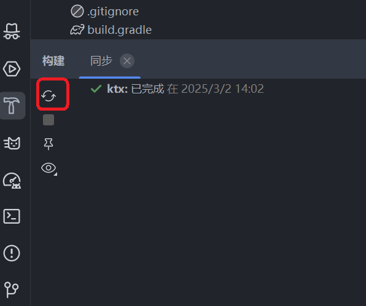
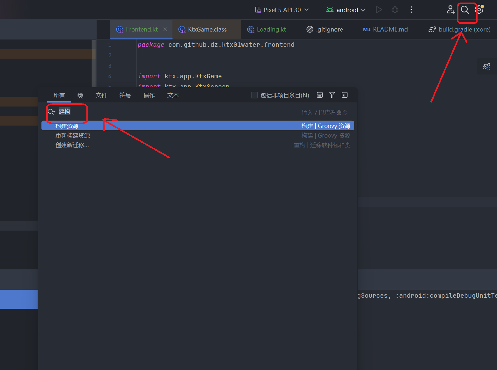
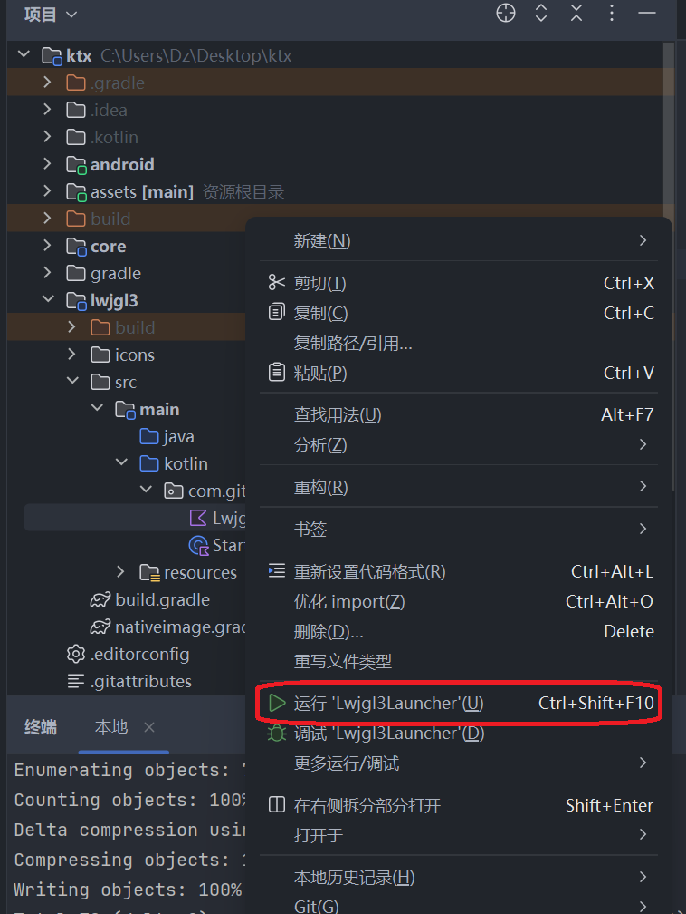

# ktx01water

A [libGDX](https://libgdx.com/) project generated with [gdx-liftoff](https://github.com/libgdx/gdx-liftoff).

This project was generated with a template that includes Kotlin application launchers and an empty `ApplicationAdapter` implemented in Kotlin.

## 项目来源

[A Simple Game - libGDX](https://libgdx.com/wiki/start/a-simple-game)

## timeline

### 2025-03-17 15:28:19

一开始为了剥离input，采用了Processor的方法，结构发现 keydown 只能捕获一次按下，连续按下不会触发，然后类似的采用了 keyTyped 也不行，比较卡顿

```kotlin
class Game(
): KtxScreen {
    init {
        Gdx.input.inputProcessor = InputLogic()
    }

    inner class InputLogic : KtxInputAdapter {
        override fun keyDown(keycode: Int): Boolean {
            val delta = Gdx.graphics.deltaTime
            when (keycode) {
                Input.Keys.A -> bucket.translateX(-speed * delta)
                Input.Keys.D -> bucket.translateX(speed * delta)
            }
            return true
        }
    }
}
```

丝滑的效果还得是放到render里面，然后用一个变量来控制

```kotlin
class Game(
): KtxScreen {
    override fun render(delta: Float) {
        input()
        batch.use(camera) {
            it.draw(background, 0f, 0f)
            bucket.draw(it)
        }
    }

    fun input() {
        val delta = Gdx.graphics.deltaTime
        if (Gdx.input.isKeyPressed(Input.Keys.A)) {
            bucket.translateX(-speed * delta)
        }
        if (Gdx.input.isKeyPressed(Input.Keys.D)) {
            bucket.translateX(speed * delta)
        }
    }
}

```


### 2025-03-14 23:47:44

了解到batch是一个接口，spritebatch 是一个实现，此外还有 PolygonSpriteBatch

了解了viewport，相当于单独管理camera的[viewport](https://libgdx.com/wiki/graphics/viewports)，处理窗口拉伸这些问题：

[difference between Viewport and camera in Libgdx?](https://stackoverflow.com/questions/40059360/difference-between-viewport-and-camera-in-libgdx)

官网的[视频](https://libgdx.com/wiki/graphics/viewports)也不错

例子：

```kotlin

class Screen(): KtxScreen {
    val camera = OrthographicCamera()
    val viewport = FitViewport(640f, 480f, camera) // 管理这个 camera

    override fun resize(width: Int, height: Int) {
        viewport.update(width, height, true) // 这里本身就会 apply
    }

    override fun render(delta: Float) {
        batch.use(camera) {
            it.draw(background, 0f, 0f)
        }
    }
}

```

### 2025-03-14 20:26:30

采用 inject 来管理全局变量，然后给个变量分散在各自的地方初始化，比如 assetManager，我就放到 loadingScreen 里面

```kotlin
class Loading(
    private val context: Context,
    private val _onLoaded: (KtxScreen) -> Unit = {},
) : KtxScreen {
    init {
        context.register {
            bindSingleton(SpriteBatch())
            bindSingleton(BitmapFont())
            bindSingleton(AssetStorage())
        }
        batch = context.inject()
        font = context.inject()

        assetStorage = context.inject()
    }
}
```

有些耦合，但是无所谓，毕竟loading确实负责加载资源，SpriteBatch和BitmapFont倒是可以放到一个更高的作用域去

### 2025-03-13 22:37:51

```kotlin
class Screen : KtxScreen {
    val batch = SpriteBatch()

    override fun render(delta: Float) {
        // !!! 不加这个就dispose的话会错误
        if (disposed) return
        batch.use(camera) {
            font.draw(it, "Loading...", 100f, 100f)
        }
    }

    override fun dispose() {
        disposed = true
        batch.dispose()
        super.dispose()
    }
}

removeScreen<Screen>()
it.dispose()

```

在使用dispose的时候，可能render还在起作用，会导致调用batch失效，一个办法是使用标志判断，还有一个是提升batch的作用域，在game上就不会这样

### 2025-03-13 20:40:52

这个[教程](https://github.com/nanshaws/LibgdxTutorial)挺不错的

### 2025-03-13 20:29:05

了解到kotlin是通过init这个来在构造函数的时候执行代码，其他函数是有fun作为前缀表示成员方法


### 2025-03-13 11:20:06

添加[资源](https://libgdx.com/wiki/start/a-simple-game#loading-assets)，采用异步加载

### 2025-03-13 10:32:38

理解了一些 dependency inject 技术，和依赖接口差不多。之所以有 ktx-inject 是为了接口简单，比如这样


```kotlin
GameScreen(inject(), inject(), inject(), inject(), inject())
```

这样这里都是inject，具体依赖的地方来更改

### 2025-03-11 21:03:10

进度推进太慢了，需要花点时间思考

### 2025-03-02 14:13:12

- [ ] 快速阅读一下 [Quillraven/SimpleKtxGame](https://github.com/Quillraven/SimpleKtxGame)

### 2025-03-02 13:57:02

参考这个项目 [sample](https://github.com/libktx/ktx-sample-project)，基本结构如此：

```kotlin
class Main : KtxGame<KtxScreen>() {
    override fun create() {
        KtxAsync.initiate()

        addScreen(FirstScreen())
        setScreen<FirstScreen>()
    }
}
```

### 2025-03-02 11:20:49

从 [KTX](https://libktx.github.io/#dependencies-section) 复制在 `core/build/gradle` 下面添加依赖

```groovy
dependencies {
  api "com.badlogicgames.gdx:gdx:$gdxVersion"
  api "org.jetbrains.kotlin:kotlin-stdlib:$kotlinVersion"
  // !!! ktx-app:
  api group: 'io.github.libktx', name: 'ktx-app', version: '1.13.1-rc1'

  if(enableGraalNative == 'true') {
    implementation "io.github.berstanio:gdx-svmhelper-annotations:$graalHelperVersion"
  }
}
```

根据 gdx-liftoff自带生成发现，可以在 gradle.properties 里面定义变量

```properties
ktxVersion=1.13.1-rc1
```

然后再改为

```groovy
dependencies {
  api "com.badlogicgames.gdx:gdx:$gdxVersion"
  api "org.jetbrains.kotlin:kotlin-stdlib:$kotlinVersion"
  // !!! ktx-app:
  api group: 'io.github.libktx', name: 'ktx-app', version: ktxVersion

  if(enableGraalNative == 'true') {
    implementation "io.github.berstanio:gdx-svmhelper-annotations:$graalHelperVersion"
  }
}
```

运行的时候发现要重启项目才会生效，后面发现可以点击重构



也可以在这搜索构建





### 2025-03-01 21:40:32

项目来源 [A Simple Game - libGDX](https://libgdx.com/wiki/start/a-simple-game)

采用 [gdx-liftoff](https://github.com/libgdx/gdx-liftoff) 生成，模板选择 kotlin，其他为空

环境 intellij

碰到的问题是 openJDK 17 有问题，设置了 java_home 为 ij 里面的jdk

运行桌面版的方式如下



## Platforms

- `core`: Main module with the application logic shared by all platforms.
- `lwjgl3`: Primary desktop platform using LWJGL3; was called 'desktop' in older docs.
- `android`: Android mobile platform. Needs Android SDK.

## Gradle

This project uses [Gradle](https://gradle.org/) to manage dependencies.
The Gradle wrapper was included, so you can run Gradle tasks using `gradlew.bat` or `./gradlew` commands.
Useful Gradle tasks and flags:

- `--continue`: when using this flag, errors will not stop the tasks from running.
- `--daemon`: thanks to this flag, Gradle daemon will be used to run chosen tasks.
- `--offline`: when using this flag, cached dependency archives will be used.
- `--refresh-dependencies`: this flag forces validation of all dependencies. Useful for snapshot versions.
- `android:lint`: performs Android project validation.
- `build`: builds sources and archives of every project.
- `cleanEclipse`: removes Eclipse project data.
- `cleanIdea`: removes IntelliJ project data.
- `clean`: removes `build` folders, which store compiled classes and built archives.
- `eclipse`: generates Eclipse project data.
- `idea`: generates IntelliJ project data.
- `lwjgl3:jar`: builds application's runnable jar, which can be found at `lwjgl3/build/libs`.
- `lwjgl3:run`: starts the application.
- `test`: runs unit tests (if any).

Note that most tasks that are not specific to a single project can be run with `name:` prefix, where the `name` should be replaced with the ID of a specific project.
For example, `core:clean` removes `build` folder only from the `core` project.
